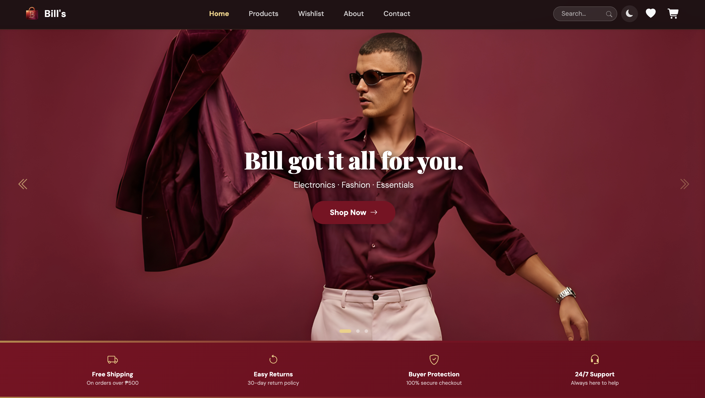
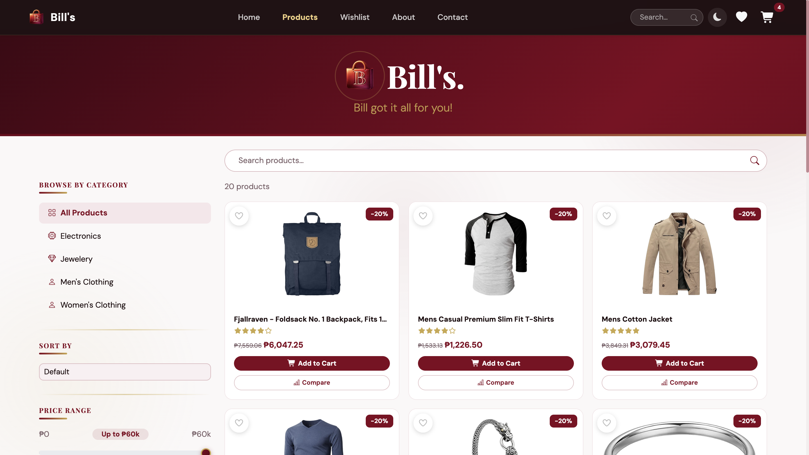
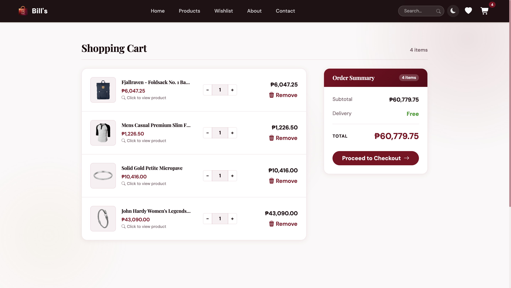
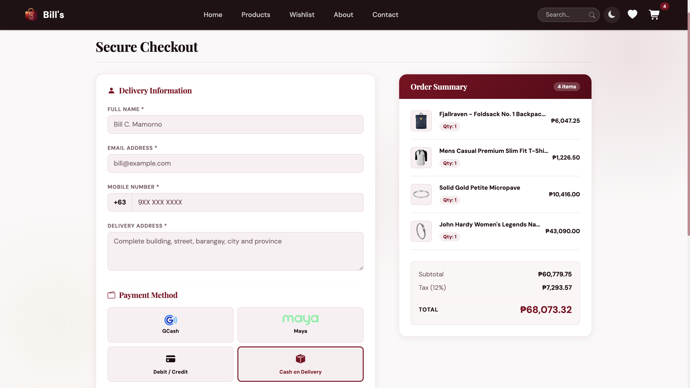

<div align="center">


# 🛍️ Bill's — Your Everything Store

**A full-featured React e-commerce web app built as a Final Project for Advanced Web Design**
*FEU Institute of Technology · A.Y. 2025–2026, 2nd Term*

[](https://your-deploy-url.vercel.app)
[](https://react.dev)
[](https://getbootstrap.com)
[](https://vitejs.dev)
[](LICENSE)

> *"Bill got it all for you."*

</div>

---

## 📸 Preview
| Home | Products | Cart | Checkout |
|------|----------|------|----------|
|  |  |  |  |

---

## ✨ Features

### 🏪 Core Shopping Experience
- **Product Listing** — Browse products fetched live from [FakeStore API](https://fakestoreapi.com), displayed in a responsive grid
- **Category Filtering** — Filter by Electronics, Men's/Women's Clothing, and Jewelry from a sidebar
- **Smart Search** — Full-text product search with URL query params (`/products?q=...`)
- **Sort & Price Range** — Sort by price, name, or rating; filter by a PHP price range slider
- **Product Modal** — Tap any card for a full-detail modal with features, description, rating, and quick actions

### 🛒 Cart & Wishlist
- **Persistent Cart** — Add, remove, and adjust quantities with a live total
- **Wishlist** — Save products for later; wishlist state persists via `localStorage`
- **Order Summary** — Subtotal, free delivery badge, and a sticky checkout panel

### 💳 Checkout
- **Multi-step Form** — Collects delivery info, validates all fields, and supports 4 payment methods:
  - Cash on Delivery (COD)
  - GCash
  - Maya
  - Credit/Debit Card (with live card number formatting)
- **Promo Codes** — Apply discount codes: `BILLS10`, `BILLS50`, `FEUTECH`, `FREESHIP`
- **12% VAT** — Automatically calculated and shown in order summary
- **Order Success Screen** — Clears cart and shows a confirmation with order details

### 🎨 UI & UX Polish
- **Dark Mode** — Toggle with a smooth animated transition (moon 🌙 / sun ☀️ overlay with orbiting particles)
- **PWA-Ready** — Service worker registered for offline/installable support
- **Scroll Reveal Animations** — Cards and sections animate in on scroll using IntersectionObserver
- **Skeleton Loaders** — Shown while product data is loading
- **Animated Stats Counter** — Homepage stats count up on load
- **Responsive Design** — Mobile-first layout with a dedicated bottom navigation bar on small screens
- **Trust Badges** — Scrollable trust row with bidirectional hints on mobile

### 📄 Pages
| Route | Page | Description |
|---|---|---|
| `/` | Home | Hero, featured products, categories, stats, recently viewed |
| `/products` | Product Listing | Full catalogue with sidebar filters and search |
| `/cart` | Cart | Item management and order summary |
| `/checkout` | Checkout | Delivery form, payment, promo codes, confirmation |
| `/wishlist` | Wishlist | Saved products grid |
| `/about` | About | Store info and founder profile |
| `/contact` | Contact | Contact form and store details |

---

## 🧱 Tech Stack

| Layer | Technology |
|---|---|
| **Framework** | React 18 (with Hooks) |
| **Build Tool** | Vite |
| **Routing** | React Router v6 |
| **Styling** | Bootstrap 5 + Custom CSS (CSS Variables, animations) |
| **Icons** | Bootstrap Icons + Font Awesome |
| **Fonts** | Playfair Display, DM Sans (Google Fonts) |
| **State Management** | React Context API (`CartContext`, `WishlistContext`) |
| **Data Source** | [FakeStore API](https://fakestoreapi.com) |
| **Persistence** | `localStorage` (dark mode, wishlist, recently viewed) |
| **PWA** | Service Worker (`sw.js`) |

---

## 🗂️ Project Structure

```
bills-store/
├── public/
│   ├── icon-512x512.png
│   ├── images/
│   │   └── bill picture.png
│   └── sw.js
├── src/
│   ├── components/
│   │   ├── Navbar.jsx        # Top nav + mobile bottom nav
│   │   ├── Footer.jsx        # Footer with newsletter form
│   │   ├── ProductCard.jsx   # Card + modal for products
│   │   ├── Sidebar.jsx       # Category, sort, price filters
│   │   └── ScrollToTop.jsx   # Auto-scroll on route change
│   ├── context/
│   │   ├── CartContext.jsx   # Global cart state & actions
│   │   └── WishlistContext.jsx
│   ├── pages/
│   │   ├── Home.jsx
│   │   ├── ProductList.jsx
│   │   ├── Cart.jsx
│   │   ├── Checkout.jsx
│   │   ├── Wishlist.jsx
│   │   ├── About.jsx
│   │   └── Contact.jsx
│   ├── App.jsx               # Routes + dark mode transition
│   ├── main.jsx              # Entry point + providers
│   └── index.css             # Global styles, CSS variables, animations
├── .github/
│   ├── screenshots/          # Preview images for README
│   └── ISSUE_TEMPLATE/
├── README.md
├── CONTRIBUTING.md
├── LICENSE
└── package.json
```

---

## 🚀 Getting Started

### Prerequisites
- **Node.js** ≥ 18.x
- **npm** or **yarn**

### Installation

```bash
# 1. Clone the repository
git clone https://github.com/your-username/bills-store.git
cd bills-store

# 2. Install dependencies
npm install

# 3. Start the development server
npm run dev
```

Open [http://localhost:5173](http://localhost:5173) in your browser.

### Build for Production

```bash
npm run build
npm run preview
```

### Available Scripts

| Script | Description |
|---|---|
| `npm run dev` | Start local dev server with HMR |
| `npm run build` | Build optimized production bundle |
| `npm run preview` | Preview production build locally |

---

## 🎁 Promo Codes

Test the checkout flow with these discount codes:

| Code | Discount |
|---|---|
| `BILLS10` | 10% off subtotal |
| `BILLS50` | ₱50 flat off |
| `FEUTECH` | 15% off (FEU discount) |
| `FREESHIP` | ₱30 shipping bonus |

---

## 🌙 Dark Mode

Click the moon/sun icon in the navbar to toggle dark mode. A custom animated overlay plays during the transition featuring orbiting particles and a glowing center icon. Preference is saved to `localStorage`.

---

## 👤 Author

<div align="center">

**Bill C. Mamorno**
*Sophomore Full Scholar · BS Information Technology – Business Analytics*
*FEU Institute of Technology*

[](https://www.facebook.com/mamornobillc/)
[](https://www.instagram.com/b1llchavez)
[](https://paraverse.feutech.edu.ph/briefcase/profile/billcmamorno)

</div>

---

## 📋 Academic Context

> This project was developed as the **Final Project** for the course **Advanced Web Design** at **FEU Institute of Technology**, Academic Year 2025–2026, 2nd Term.

### Learning Objectives Demonstrated
- ✅ Component-based architecture with React
- ✅ Client-side routing with React Router v6
- ✅ Global state management via Context API
- ✅ RESTful API consumption (FakeStore API)
- ✅ Responsive design with Bootstrap 5 and custom CSS
- ✅ CSS animations, transitions, and custom properties
- ✅ Form validation and user feedback patterns
- ✅ Progressive Web App (PWA) fundamentals
- ✅ localStorage for client-side persistence

---

## 📜 License

This project is licensed under the **MIT License** — see the [LICENSE](LICENSE) file for details.

---

<div align="center">

Made with ❤️ by **Bill C. Mamorno** · FEU Institute of Technology

*Bill got it all for you.*

</div>
